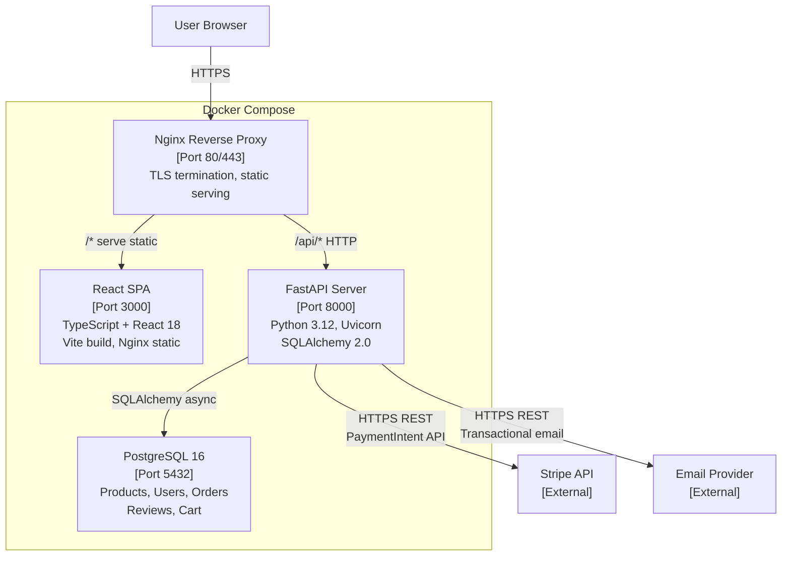
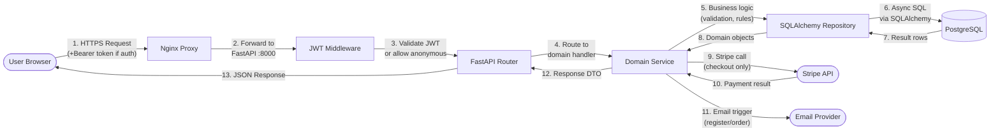
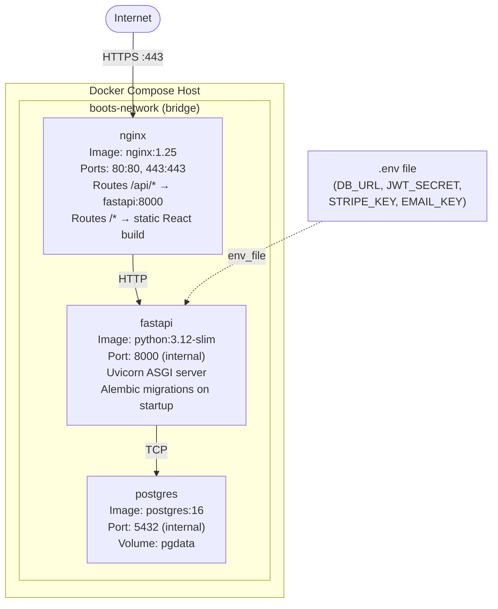
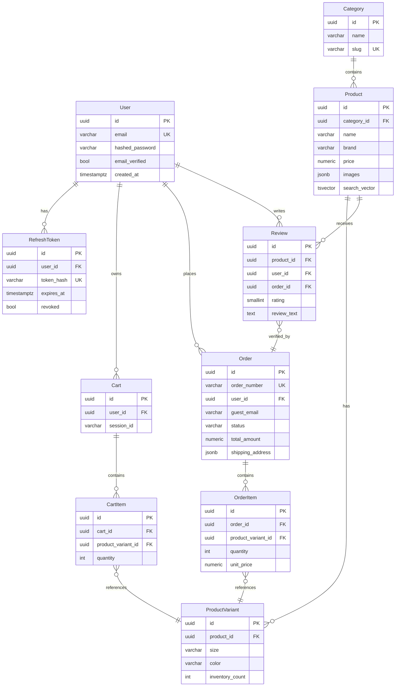
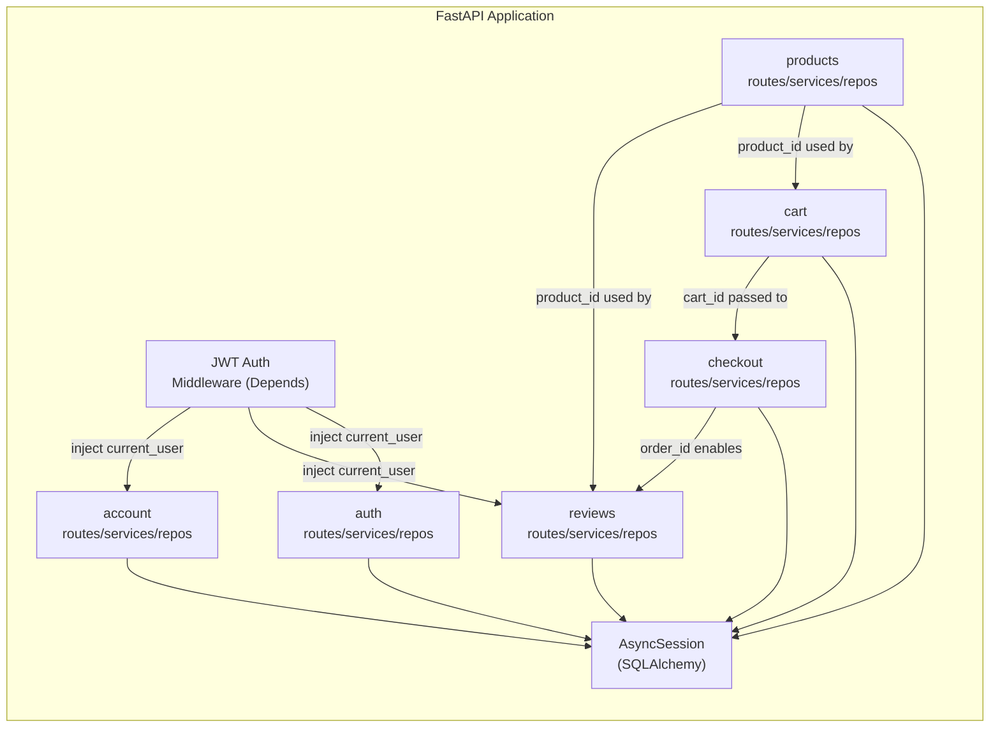
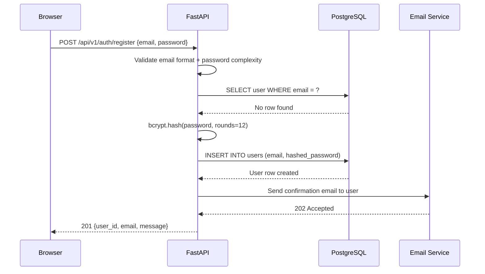
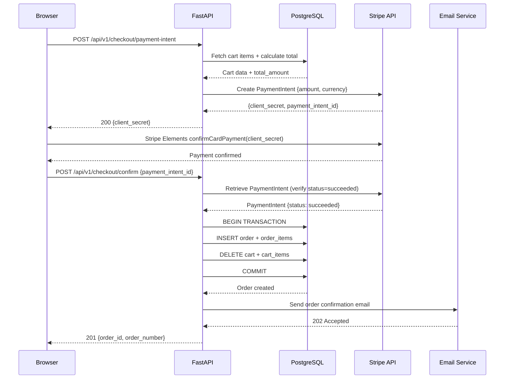
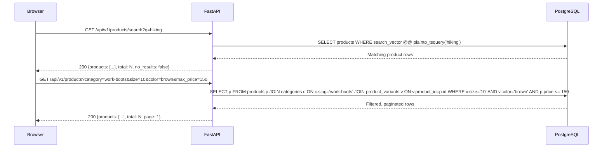
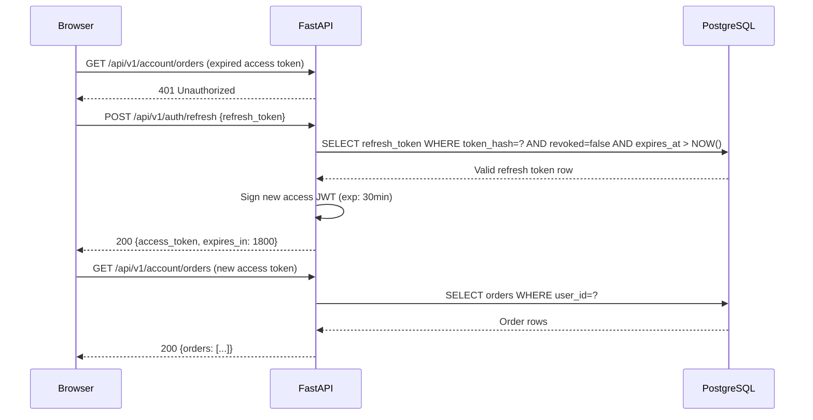
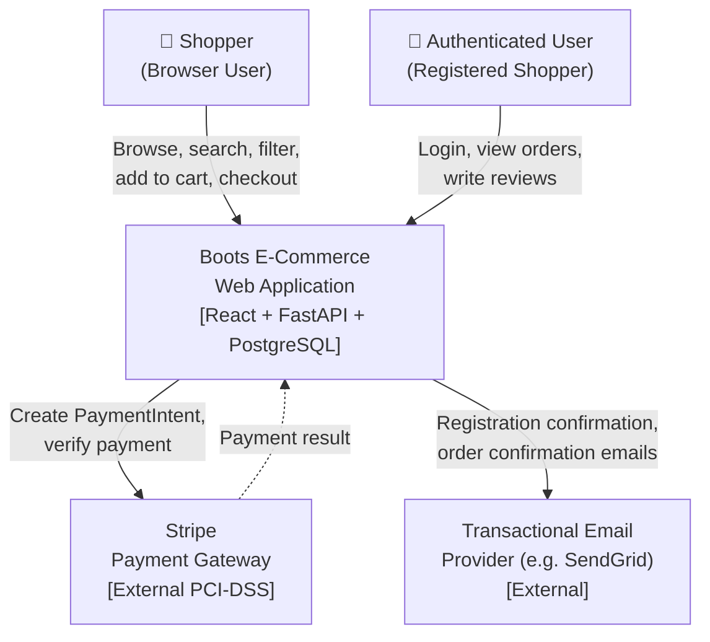

# Architecture Diagrams — Boots Shopping App

> Generated by Elite AI Pod's Solution Architect agent on 2026-07-07T05:22+00:00.
> Mermaid diagrams render natively on GitHub.

## Boots E-Commerce — Container Diagram (C4 Level 2)

Shows the four Docker Compose containers: Nginx reverse proxy, React SPA, FastAPI backend, and PostgreSQL database, with their communication protocols and ports.

## End-to-End Data Flow

Shows how data moves through the system from user browser action through Nginx, FastAPI business logic, PostgreSQL persistence, and optional external service calls back to the browser.

## Docker Compose Deployment Topology

Infrastructure layout showing four Docker containers, their exposed ports, named volumes for data persistence, and an environment variable file for secrets management.

## Entity Relationship Diagram

Full ERD showing all ten database tables and their foreign key relationships, from users through products, carts, orders to reviews.

## FastAPI Internal Module Boundaries

Shows the six domain modules inside FastAPI (auth, products, cart, checkout, reviews, account) and how they interact via shared database models and dependency injection.

## Sequence Diagrams

### User Registration Flow

End-to-end sequence for new user registration: form submission, email uniqueness check, bcrypt hashing, user creation, and confirmation email dispatch.

### Guest Checkout with Stripe Payment

Full checkout sequence: shipping info collection, server-side PaymentIntent creation, client-side card capture via Stripe Elements, payment verification, and order record creation with confirmation email.

### Product Search and Filter Flow

Sequence for keyword search and faceted filtering: full-text search using PostgreSQL tsvector, and conjunctive filter query via variant joins.

### JWT Session Refresh Flow

Shows how the React frontend silently refreshes an expired access token using the refresh token, maintaining session continuity without redirecting to login.

## Boots E-Commerce — System Context (C4 Level 1)

Shows the boots e-commerce web application in context with its users and external systems: Stripe for payment processing and a transactional email provider for confirmations.

